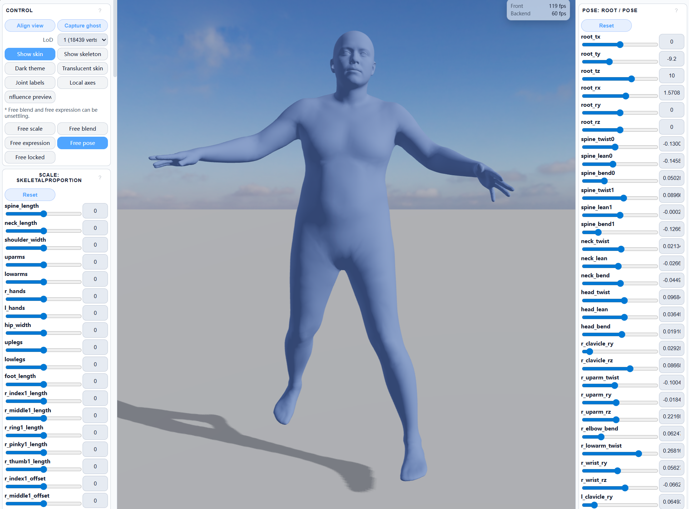
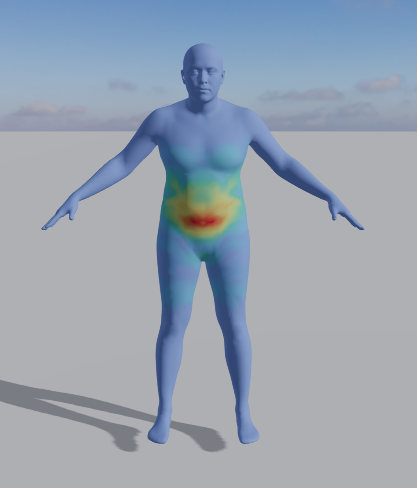
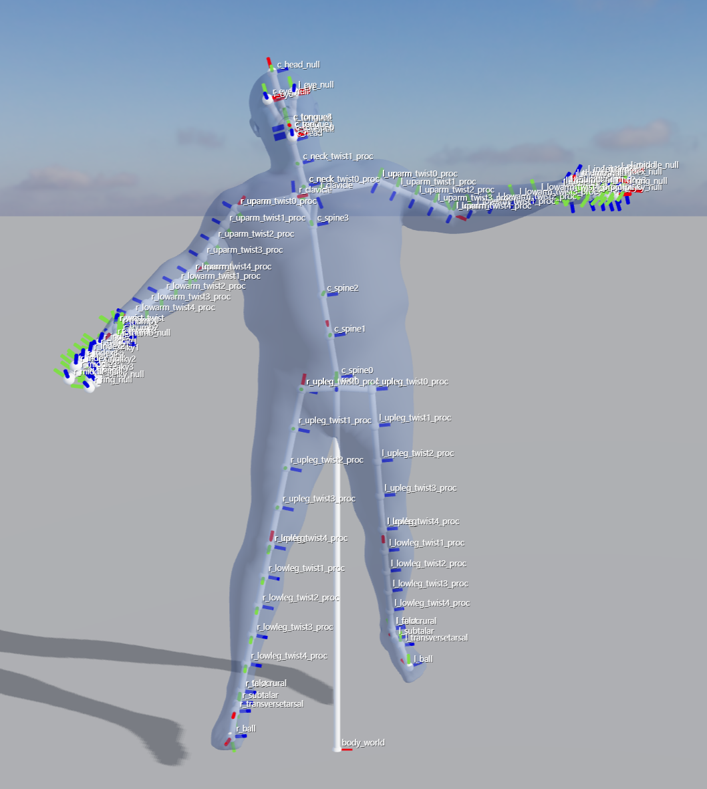
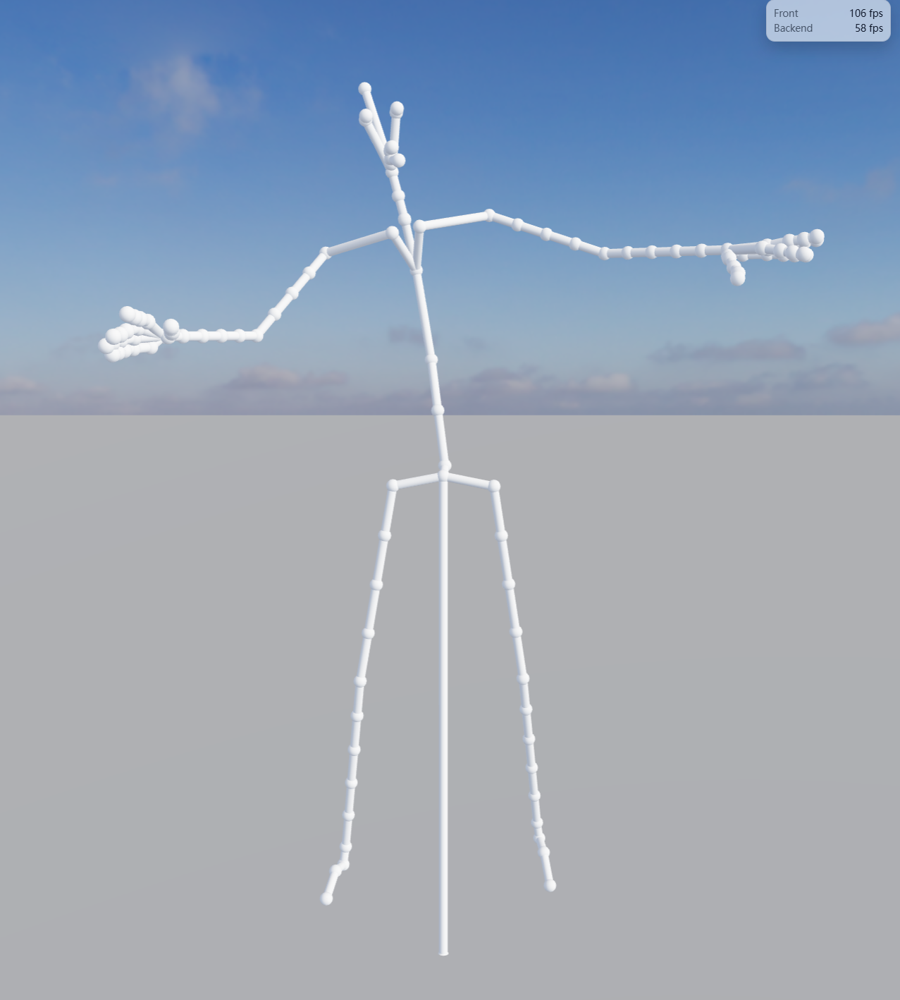

English | [简体中文](README.zh-CN.md)

# MHR Play



MHR Play is a public-facing interactive MHR experience built on top of `mujoco-wasm-play`. It combines official MHR assets, an optimized WASM runtime, and a Play-style Three.js viewer into a single browser product surface.

## Highlights

- **Full official MHR asset path**: the page loads the full official runtime IR instead of a simplified demo mesh.
- **Play-style browser UI**: panels, HUD, camera controls, and scene interaction are hosted by `mujoco-wasm-play`.
- **Multi-LoD support**: the same runtime surface supports `lod0..lod6` and can switch LoD in-page.
- **Rich debugging overlays**: skeleton, joint labels, local axes, and influence-preview heatmaps are available in the viewer.
- **Performance-oriented runtime**: the heavy-family WASM core has been optimized specifically for interactive `blend` / `expression` workloads.

## Parity

- The portable runtime follows the optimized sparse execution path and is **not bitwise exact** to the **official full-package CPU route** (`official-full-cpu`).
- On the current golden cases, the remaining vertex residuals stay in the low `1e-5` range, which is the same order of magnitude we observe in the **official TorchScript model route** (`official-torchscript`, `lod=1` only).
- The official TorchScript model route is kept as a secondary reference route, not the primary public runtime.

## Gallery

| Influence Preview | Skin / Skeleton / Joint Axes / Labels | Skeleton View |
|---|---|---|
|  |  |  |

## Quickstart

- Start the local page from the repository root:

```powershell
$env:PYTHON_EXE='<python>'
powershell -NoProfile -ExecutionPolicy Bypass -File .\mjwp_inject\run.ps1 -PlaySrc ..\mujoco-wasm-play -Port 4269 -Lod 1
```

- Open:

```text
http://127.0.0.1:4269/mhr.html?lod=1
```

- If the port is busy, change both `-Port` and the URL port together.
- To test a different LoD, change both `-Lod` and the `?lod=` query parameter.

## Project Layout

- `mjwp_inject/`: downstream Play assembly, MHR profile/plugin, public page entry
- `assets/`: screenshots used for public-facing presentation
- `tools/`: preprocessing, build, bench, smoke, and repository guardrails
- `tests/`: tooling, contract, and smoke regression coverage
- `native/`: portable runtime core and C ABI
